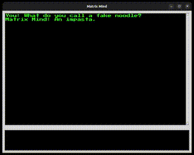

# Matrix Mind Application

Matrix Mind is a chat application that interfaces with OpenAI's GPT-3.5 to provide a retro, terminal-like chatting experience.
This is inspired from the sci-fi (cyber|retro)punk like Matrix, Ghost in the Shell etc.



## Features

- Terminal-like UI.
- Concise responses from OpenAI's GPT-3.5.

## Installation

### Prerequisites

- Python 3.x
- "Press Start 2P" font. [Installation instructions](https://fonts.google.com/specimen/Press+Start+2P).

### Setup

1. Clone the repository:

```bash
git clone https://github.com/saurabhchalke/matrixmind.git

```

2. Navigate to the cloned directory:

```bash
cd matrixmind
```

3. Install the required packages:
```bash
pip install -r requirements.txt

```

4. The GUI is created using Tkinter, which should probably be installed by default on macOS/Windows, but if you're a Linux user like me, you would need to install the `python3-tk` package.

```bash
sudo apt install python3-tk
```

5. Run the application:

```bash
python matrixmind.py
```

## Usage

After launching the application, type your message and press Enter to send. The response from OpenAI's GPT-3.5 will appear shortly.

## Contributing

Contributions to the Matrix Mind project are welcome. Feel free to fork the repo, make changes, and submit a pull request.

## License

This project is licensed under the [MIT License](LICENSE).
